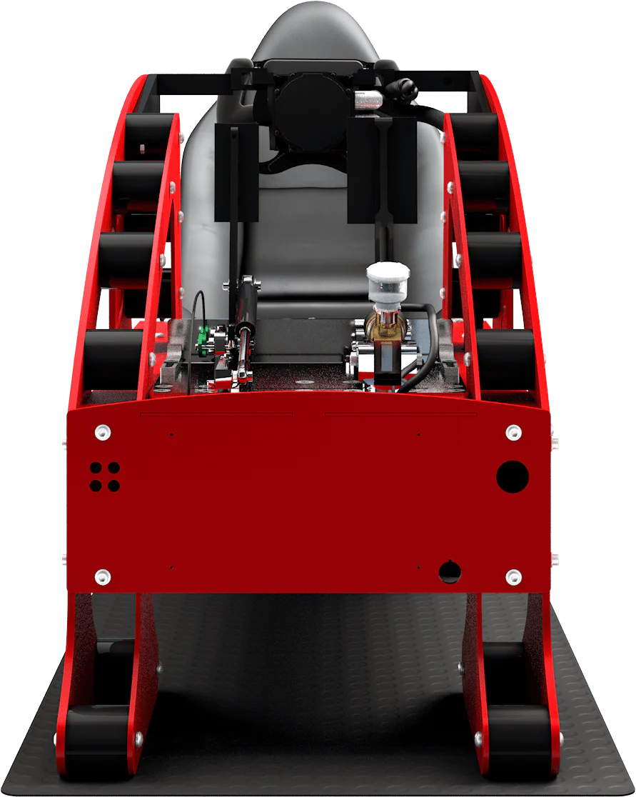
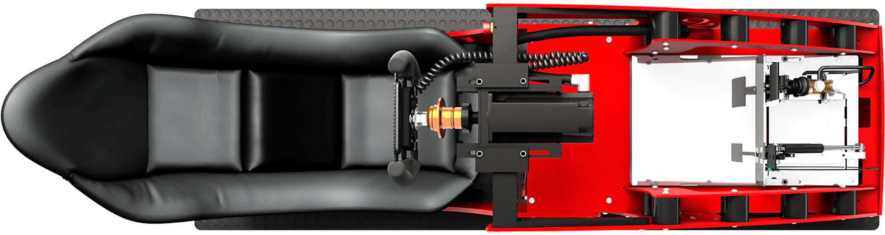

## Sim Rig Prototype Ideas

<video autoplay="" data-object-fit="cover" data-wf-ignore="true" loop="" muted="" playsinline="" style="background-image:url(&quot;//cdn.shopify.com/s/files/1/0435/4631/2853/t/13/assets/steering_video_2reload-transcode.jpg?v=52621540023882878061644056633&quot;)">
          <source data-wf-ignore="true" src="//cdn.shopify.com/s/files/1/0435/4631/2853/t/13/assets/steering_video_2reload-transcode.mp4?v=76053544966653525591646507092">
          <source data-wf-ignore="true" src="//cdn.shopify.com/s/files/1/0435/4631/2853/t/13/assets/steering_video_2reload-transcode.webm?v=45681008686365058341646507190">
        </video>

