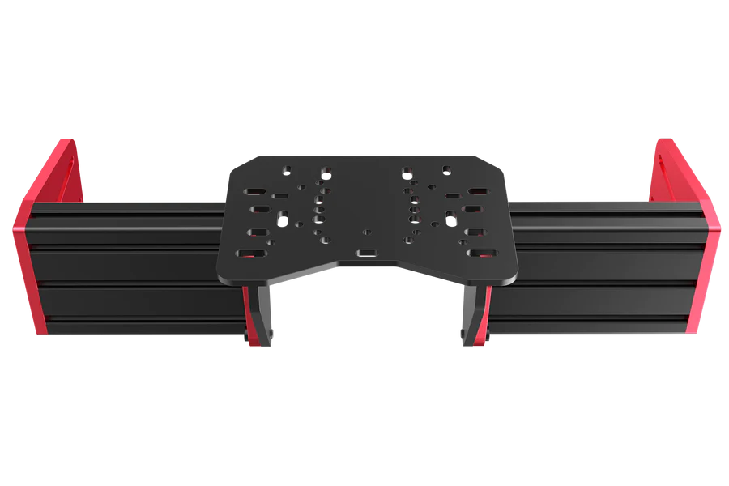
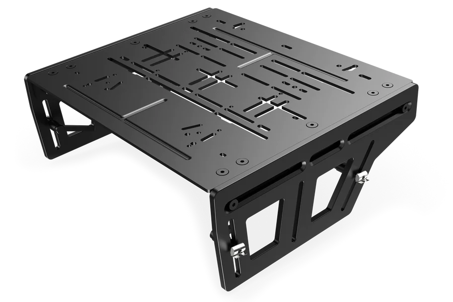
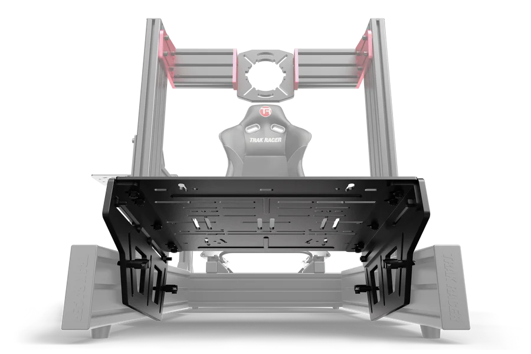
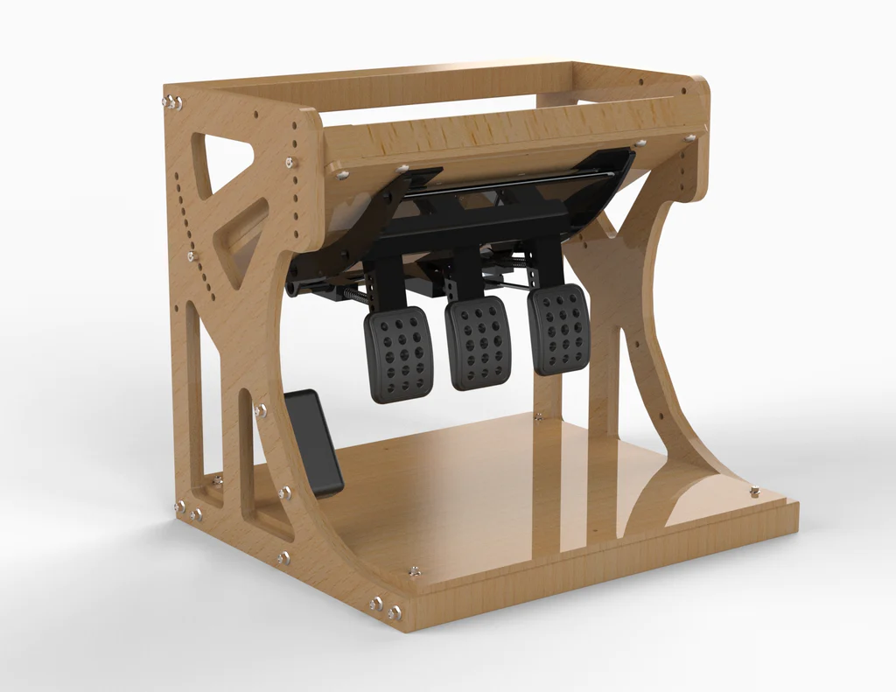
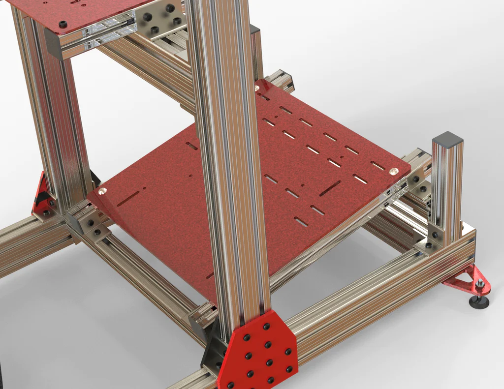

## Base Plates

[Cockpits](/cockpits.md)

[Drilling Templates](/templates.md)

    
    
Fig 1

    
    
Fig 2

    
    
Fig 3

    
    
Fig 4

    
    
Fig 5

    
    
Fig 6

    
    
Fig 7

